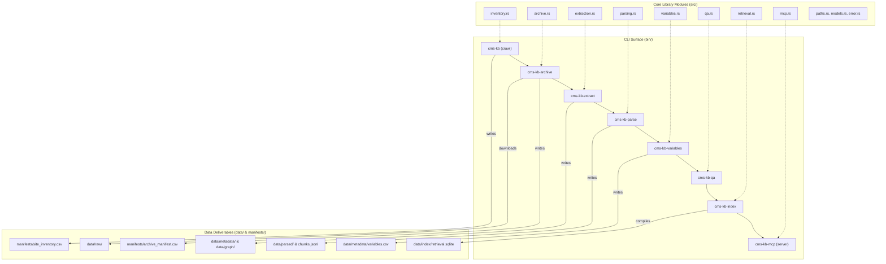

# High-Level Design Document: Rust Rewrite of CMS Knowledge Base

This document establishes the high-level design, technical considerations, and implementation roadmap for rewriting the CMS Knowledge Base (CMS KB) system in Rust. 

The current Python implementation (as described in [ARCHITECTURE.md](file:///home/saehwan/repos/resdac-knowledge-base/ARCHITECTURE.md)) successfully addresses crawling, archiving, parsing, indexing, and retrieval over CMS/ResDAC documentation. However, a Rust rewrite will dramatically improve pipeline throughput, resource efficiency, and deployment simplicity, while aligning perfectly with the repository's strict constraints on functional patterns and Railway-Oriented Programming (ROP).

---

## 1. Executive Summary & Core Rationale

The rewrite aims to migrate the pipeline CLIs, metadata extractors, parsing utilities, and Model Context Protocol (MCP) server from Python to a unified, high-performance Rust crate and binary suite.

### Key Drivers for the Rust Rewrite

*   **Concurrency & Network I/O Speed**: Crawling thousands of ResDAC pages (Phase 0/1) sequentially in Python is slow. In Rust, async I/O via [tokio](https://crates.io/crates/tokio) and [reqwest](https://crates.io/crates/reqwest) allows high-concurrency downloads with lightweight green threads, significantly reducing execution time.
*   **Polite Rate Limiting & Flow Control**: ResDAC aggressively rate-limits requests with HTTP `429 Too Many Requests` (see [developer-guide.md](file:///home/saehwan/repos/resdac-knowledge-base/docs/developer-guide.md#L93-L98)). Rust allows fine-grained, async rate limiting via [governor](https://crates.io/crates/governor) to coordinate multiple request streams politely without thread contention.
*   **CPU-Bound Pipeline Performance**: Extracting metadata and parsing text chunks across 27,000+ files is highly CPU-bound. Python's Global Interpreter Lock (GIL) prevents true parallelism. Rust's data-parallelism library [rayon](https://crates.io/crates/rayon) enables lock-free parallel extraction and parsing across all available CPU cores.
*   **Statically Linked Single-Binary Deployment**: Python requires a virtual environment, `uv`, and multiple system dependencies (such as C-bindings for PyMuPDF). A Rust-compiled binary packages all logic (crawling, parsing, SQLite indexing, semantic search, and MCP server) into a single, self-contained executable with zero runtime dependencies.
*   **Low Memory Footprint**: The Python MCP server and hybrid search pipeline pull in heavy packages like `sentence-transformers`, PyTorch, and NumPy, consuming hundreds of megabytes of RAM. A Rust implementation using [candle](https://crates.io/crates/candle) or [ort](https://crates.io/crates/ort) for local embeddings runs with a fraction of the memory footprint.
*   **Semantic Alignment with ROP Constraints**: [AGENTS.md](file:///home/saehwan/repos/resdac-knowledge-base/AGENTS.md) mandates Railway-Oriented Programming (ROP): returning success/failure values rather than throwing exceptions, keeping the happy path linear, and isolating side effects. Rust’s monadic `Result<T, E>` and `Option<T>` types, along with the `?` propagation operator, are the industry-standard implementation of this paradigm.

---

## 2. Component Mapping: Python to Rust

The proposed Rust project will be structured as a cargo workspace or a single library crate (`cms_kb_rs`) with multiple binary targets, mapping directly to the existing Python modules.

| Python Component | Primary Python Library | Proposed Rust Module / Binary | Primary Rust Crate |
| :--- | :--- | :--- | :--- |
| **Paths Resolution** | `importlib.resources` | `src/paths.rs` | `std::env::current_exe` |
| **Inventory Crawl** | `urllib.request`, `HTMLParser` | `bin/cms-kb` & `src/inventory.rs` | `reqwest`, `scraper` / `tl` |
| **Archiver** | `urllib.request` | `bin/cms-kb-archive` & `src/archive.rs` | `reqwest`, `tokio`, `governor` |
| **Metadata Extraction** | `HTMLParser` | `bin/cms-kb-extract` & `src/extraction.rs` | `scraper` |
| **Document Parser** | `trafilatura`, `PyMuPDF`, custom XML | `bin/cms-kb-parse` & `src/parsing.rs` | `readability`, `pdf-extract`, `calamine` |
| **Variable Extractor** | `re`, `HTMLParser` | `bin/cms-kb-variables` & `src/variables.rs` | `regex`, `rayon`, `scraper` |
| **SQLite Serving Index** | `sqlite3` (FTS5), `sentence-transformers` | `bin/cms-kb-index` & `src/retrieval.rs` | `rusqlite` (with FTS5), `candle` / `ort` |
| **Agent API** | `pydantic` | `bin/cms-kb-agent-context` & `src/agent_api.rs` | `serde`, `serde_json` |
| **MCP Server** | `mcp` SDK (stdio/SSE) | `bin/cms-kb-mcp` & `src/mcp.rs` | `tokio`, `axum` (for SSE) |
| **Quality Assurance** | Checksum loop, cross-file reference | `bin/cms-kb-qa` & `src/qa.rs` | `sha2`, `rayon`, `csv` |
| **Evaluation Suite** | Custom Recall/MRR calculator | `bin/cms-kb-evaluate` & `src/evaluation.rs` | Native `cargo test` / custom math |

### Architecture Dependency & Handoff Flow



---

## 3. Key Technical Considerations & Design Decisions

### 3.1. Concurrency, Rate Limiting, and Politeness (Phase 0 & 1)
Python's crawler crawls sequentially. In Rust, async requests run concurrently. However, the target server (ResDAC) will reject burst traffic.
*   **Design Decision**: We will use [governor](https://crates.io/crates/governor), a pure-Rust rate-limiting library based on the Generic Cell Rate Algorithm (GCRA). We will set up a global rate-limiter instance shared across all worker tasks in a `tokio::sync::mpsc` queue.
*   **Connection Politeness**: We will configure [reqwest::Client](https://docs.rs/reqwest/latest/reqwest/struct.Client.html) with a custom `User-Agent`, a single connection pool, and socket timeouts.
*   **Automatic Retry & Deferral**: When hitting `429 Too Many Requests`, worker tasks will inspect the `Retry-After` header. If present, the rate limiter will dynamically adjust its window. If a variable-detail URL slug fails repeatedly (exceeding `max_consecutive_rate_limits`), the task will return a `DownloadResult::Deferred` status to be logged into `archive_manifest.csv`, matching the Python rate-limiting strategy.

### 3.2. Extraction & Parsing Library Selection (Phase 2 & 3)
Python leverages heavy dependencies like PyMuPDF and trafilatura. We must choose lightweight, robust Rust alternatives.
*   **HTML Parsing**: We will use [scraper](https://crates.io/crates/scraper) for DOM traversal via CSS selectors. This is more readable and maintainable than Python's subclassed `HTMLParser`. For high-speed tokenization without DOM overhead, [tl](https://crates.io/crates/tl) can be used.
*   **Web Text Extraction**: For extracting main text content (excluding sidebars/menus), we will use [readability-lrs](https://crates.io/crates/readability-lrs) (a Rust port of Mozilla's Readability) or write custom selector-based text extraction rules in `src/parsing.rs` to match current python clean-text baselines.
*   **PDF Parsing**: We will use [pdf-extract](https://crates.io/crates/pdf-extract) or [lopdf](https://crates.io/crates/lopdf) to parse text page-by-page. To avoid system C-library dependencies (like Poppler), pure-Rust libraries are preferred.
*   **XLSX Parsing**: The Python codebase uses a custom ZIP/XML parse loop to extract spreadsheet cells without pandas/openpyxl. In Rust, we will use the excellent [calamine](https://crates.io/crates/calamine) crate. It is a pure-Rust spreadsheet reader that parses XLS, XLSX, XLSB, and ODS formats with extreme speed and memory efficiency.

### 3.3. SQLite serving Index & Local Semantic Search (Phase 7 & 10)
The SQLite FTS5 index is a derived runtime serving database compiled from CSV and JSONL records.
*   **SQLite Connection**: We will use the [rusqlite](https://crates.io/crates/rusqlite) crate. The `fts` feature must be enabled, allowing FTS5 tokenization, search queries, and `bm25` scoring.
*   **Zero-Dependency Local Embeddings**: The Python pipeline relies on `sentence-transformers` (which downloads PyTorch, NumPy, etc.) to perform semantic search. In Rust, we have two options to run embedding generation (e.g. `all-MiniLM-L6-v2`) locally:
    1.  **ONNX Runtime (via [ort](https://crates.io/crates/ort))**: Bindings to ONNX Runtime. Extremely fast and mature, but requires the ONNX Runtime library to be present on the host system or compiled.
    2.  **Hugging Face Candle (via [candle-core](https://crates.io/crates/candle-core))**: A minimalist, pure-Rust machine learning framework. It compiles completely inside our binary, allowing us to load GGUF or Safetensors models directly with zero system dependencies.
*   **Design Decision (Recommended)**: Use `candle-core` for embedding generation to guarantee that the compiled binary remains 100% self-contained and easy to distribute.

### 3.4. Railway-Oriented Error Handling & Functional Pipeline
Python relies on exceptions and manual tuple checks. Rust's type system handles this natively.
*   **Unified Error Enum**: We will define a `KBError` enum encapsulating all pipeline errors:
  ```rust
  pub enum KBError {
    Network(reqwest::Error),
    Io(std::io::Error),
    Csv(csv::Error),
    Parser(String),
    Database(rusqlite::Error),
    Validation(String),
  }
  ```
*   **Pipeline Monads**: Functions will return `Result<T, KBError>`. We will use combinators (`.map()`, `.and_then()`, `.or_else()`) to process text chunking and metadata transformations. Side effects (e.g., writing files to disk) will be strictly confined to terminal points in CLI executors, keeping the core pipeline functions pure and testable.

---

## 4. Data Flow & Storage Integrity

We will maintain the architectural constraint that CSV and JSONL files are the canonical inputs to downstream extraction, and the SQLite index is a derived artifact (see [ROADMAP.md](file:///home/saehwan/repos/resdac-knowledge-base/ROADMAP.md#L27-L28)).

### Schema Representation with Serde

Instead of Python's runtime `Pydantic` validation, Rust will use [serde](https://serde.rs/) for compile-time generation of serializers and deserializers.

```rust
use serde::{Deserialize, Serialize};

#[derive(Debug, Clone, Serialize, Deserialize)]
pub struct DatasetRecord {
  pub dataset_id: String,
  pub name: String,
  pub program: String,
  pub category: String,
  pub availability: String,
  pub source_url: String,
  #[serde(default)]
  pub local_path: String,
  #[serde(default)]
  pub sha256: String,
  #[serde(default)]
  pub extraction_notes: String,
}

#[derive(Debug, Clone, Serialize, Deserialize)]
pub struct RetrievableRecord {
  pub record_id: String,
  pub record_type: String,
  pub title: String,
  #[serde(default)]
  pub dataset_id: String,
  pub text: String,
  pub source_url: String,
  #[serde(default)]
  pub source_document: String,
  pub page: Option<u32>,
  #[serde(default)]
  pub exact_terms: Vec<String>,
}
```

---

## 5. Phase-Based Roadmap

The migration will be completed in 7 sequential phases. Each phase has a concrete scope, deliverables, and testing strategy.

```text
Phase A: Foundations & Models ────► Phase B: Crawl & Archive
                                            │
                                            ▼
Phase D: Graph & Variable ◄────── Phase C: Metadata & Parse
        │
        ▼
Phase E: Search & Reranking ─────► Phase F: MCP Server ────► Phase G: Evaluation & Release
```

---

### Phase A: Foundation, Models, and Tooling
*   **Objective**: Bootstrap the Rust workspace, shared libraries, serialization models, CLI flags, and paths resolution.
*   **Subphases**:
    *   *Subphase A.1*: Initialize Cargo workspace and create core library crate `cms_kb_rs` and binary files.
    *   *Subphase A.2*: Port all schema models ([data-model.md](file:///home/saehwan/repos/resdac-knowledge-base/docs/data-model.md)) to Rust structs with `serde`.
    *   *Subphase A.3*: Implement configuration parsing using [clap](https://crates.io/crates/clap) (v4 with derive macro).
*   **Dependencies**: None.
*   **Deliverables**: `Cargo.toml`, `src/models.rs`, `src/config.rs`, `src/error.rs`, and initial CLI entry points.
*   **Testing Strategy**: Unit tests in `src/models.rs` verifying CSV and JSON roundtrip serialization using mock records.

---

### Phase B: Concurrent Discovery & Archival (Phase 0 & 1)
*   **Objective**: Implement the async web crawler and archive preservation manager.
*   **Subphases**:
    *   *Subphase B.1*: Build the BFS crawler (`src/inventory.rs`) traversing listings and compiling URLs using `reqwest` and `scraper`.
    *   *Subphase B.2*: Build the concurrent archiver (`src/archive.rs`) with rate limiting (`governor`), checksum verification (`sha2`), and atomic writes using temporary files.
    *   *Subphase B.3*: Implement JSONL progress logging (`src/progress.rs`) mimicking the Python logging system.
*   **Dependencies**: Phase A.
*   **Deliverables**: Binaries `cms-kb` and `cms-kb-archive`, plus manifests `site_inventory.csv` and `archive_manifest.csv`.
*   **Testing Strategy**: Integration tests downloading from a local mock HTTP server (using [wiremock](https://crates.io/crates/wiremock)) to test concurrency, 429 rate limit backoff, retry headers, and duplicate checksum skipping.

---

### Phase C: Metadata Extraction & Document Parsers (Phase 2 & 3)
*   **Objective**: Process HTML, PDF, and XLSX files to extract structured catalogs and chunks.
*   **Subphases**:
    *   *Subphase C.1*: Port HTML table parser (`src/extraction.rs`) to extract datasets, documents, and programs ontology.
    *   *Subphase C.2*: Integrate PDF text extraction (`pdf-extract`) and XLSX cell processing (`calamine`) in `src/parsing.rs`.
    *   *Subphase C.3*: Implement sliding-window chunking logic to emit `chunks.jsonl` with metadata alignment.
*   **Dependencies**: Phase B.
*   **Deliverables**: Binaries `cms-kb-extract` and `cms-kb-parse`.
*   **Testing Strategy**: Comparative extraction assertion tests: verify that Rust output matches existing Python CSV hashes for a static archived dataset page and spreadsheet.

---

### Phase D: Knowledge Graph & Variable Extraction (Phase 4, 5 & 6)
*   **Objective**: Synthesize ontology networks, extract variable definitions, and execute QA validation.
*   **Subphases**:
    *   *Subphase D.1*: Implement regex-based variable pattern matching over chunks in parallel using `rayon`.
    *   *Subphase D.2*: Build variable-detail page HTML scraper (`src/variables.rs`) to resolve canonical variables.
    *   *Subphase D.3*: Implement the QA auditor (`src/qa.rs`) checking checksums, cross-references, and graph constraints.
*   **Dependencies**: Phase C.
*   **Deliverables**: Binaries `cms-kb-variables` and `cms-kb-qa`.
*   **Testing Strategy**: Execute `cms-kb-qa` over generated outputs; verify zero validation errors and check that variable-to-dataset containment links are fully resolved.

---

### Phase E: Storage Index & Hybrid Retrieval Core (Phase 7 & 10)
*   **Objective**: Compile the SQLite serving index, implement BM25 lexical search, and add optional local semantic reranking.
*   **Subphases**:
    *   *Subphase E.1*: Implement SQLite FTS5 database builder and connection pool in `src/retrieval.rs` using `rusqlite`.
    *   *Subphase E.2*: Port custom exact-term boosting and token parsing matching Python's lexical retrieval score rules.
    *   *Subphase E.3*: (Optional) Implement local embedding compilation and cosine similarity blending using Hugging Face `candle`.
*   **Dependencies**: Phase D.
*   **Deliverables**: Binaries `cms-kb-index` and `cms-kb-search`.
*   **Testing Strategy**: Benchmark query tests: run search queries and verify that results match the exact identifier ranking order and scores generated by Python retrieval.

---

### Phase F: Serving Surface (MCP Server & Agent API) (Phase 8)
*   **Objective**: Expose the knowledge base to external AI agents via the Model Context Protocol.
*   **Subphases**:
    *   *Subphase F.1*: Build the Model Context Protocol (MCP) server layer supporting standard `stdio` JSON-RPC 2.0 communication.
    *   *Subphase F.2*: Implement SSE (Server-Sent Events) HTTP transport server using [axum](https://crates.io/crates/axum).
    *   *Subphase F.3*: Port the agent context retrieval formatter mapping citation records into structured JSON outputs.
*   **Dependencies**: Phase E.
*   **Deliverables**: Binaries `cms-kb-mcp` and `cms-kb-agent-context`.
*   **Testing Strategy**: Client-server validation: simulate standard MCP client requests (`tools/list`, `tools/call` for `search_variables`, `get_agent_context`) over stdio and assert JSON-RPC compliance.

---

### Phase G: Integration, Evaluation, and Release (Phase 9 & 12)
*   **Objective**: Port evaluation benchmarks, verify performance gains, and compile final distribution binaries.
*   **Subphases**:
    *   *Subphase G.1*: Port Phase 12 evaluation metrics runner (`src/evaluation.rs`), computing Recall@5, MRR, and citation metrics.
    *   *Subphase G.2*: Execute comparative benchmarks against Python implementation. Verify that latency drops below the 10ms warm threshold.
    *   *Subphase G.3*: Compile static release binaries (`cargo build --release`) and document migration steps.
*   **Dependencies**: Phase F.
*   **Deliverables**: Statically linked CLI binary `cms-kb-rs` containing all tools, performance report, and migration documentation.
*   **Testing Strategy**: Execute the full benchmark evaluation query set; verify zero regression in metrics compared to Python baseline metrics.

---

## 6. Risk Mitigation & Verification Strategy

### Potential Risks & Countermeasures

| Risk Identified | Severity | Mitigation Plan |
| :--- | :--- | :--- |
| **ResDAC Rate Blocking** | High | Start crawling with strict conservative concurrency bounds (e.g. max 2 concurrent connection tasks, 0.5s delays). Dynamically inspect TCP connection status and decrease token refresh rate on the `governor` rate limiter if connections reset. |
| **PDF Parser Incompatibilities** | Medium | PyMuPDF handles some broken PDF layouts better than basic libraries. If `pdf-extract` fails on certain ResDAC files, wrap native `poppler` or `fitz` via static C-bindings inside Rust, or use a subprocess fallback. |
| **Relevance Score Divergence** | Medium | Minor differences in tokenization or FTS5 scoring could change search ranking. Mitigation: maintain unit-test fixtures asserting that exact-match and lexical results stay 100% identical to python results for the gold standard queries. |
| **Compilation Overhead for ML** | Low | Including `candle` or `ort` increases compile times and binary size. Mitigation: separate embedding generation behind a Cargo feature flag (`--features semantic`). The default build can remain purely lexical (FTS5 SQLite), which is lightweight and fast. |
