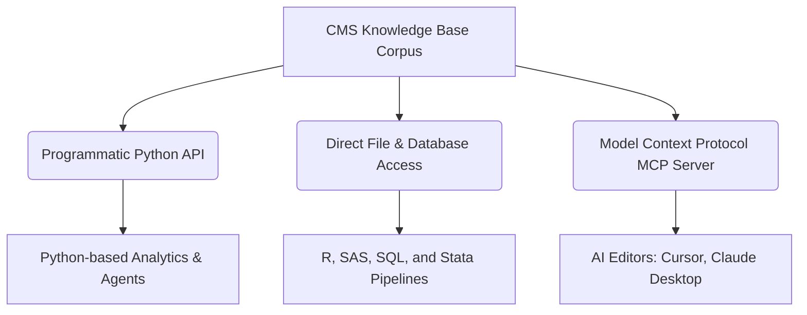

# Reusing the CMS Knowledge Base in External Projects

This guide describes how to consume the CMS Knowledge Base (KB) in external workflows and projects, such as Medicare data analytical packages, cohort construction pipelines, and AI coding assistants. It also details how to bundle pre-built data artifacts and publish the package to PyPI.

---

## 1. Integration Vectors

Once the crawling, parsing, metadata extraction, and indexing phases are complete, external projects can consume the knowledge base through three primary interfaces:



### A. Programmatic Python API
If your downstream project is written in Python, you can import [cms_kb](file:///Users/saehwan/gitrepos/resdac-knowledge-base/src/cms_kb/__init__.py) directly. The package exposes clean interfaces for lexical search and context retrieval:
*   [run_retrieval](file:///Users/saehwan/gitrepos/resdac-knowledge-base/src/cms_kb/retrieval.py#L573): Queries the pre-compiled SQLite FTS5 search index.
*   [build_agent_context](file:///Users/saehwan/gitrepos/resdac-knowledge-base/src/cms_kb/agent_api.py#L274): Runs search queries, extracts variable links, maps local files to URLs, and returns citation-preserving results.

### B. Direct File & Database Access
Since all generated metadata files are saved as standard CSVs, text chunks as JSONL, and search indices as SQLite databases, external systems written in other analytical languages (SAS, R, Stata, SQL) can consume the files directly under the [data/](file:///Users/saehwan/gitrepos/resdac-knowledge-base/data) directory.

### C. MCP Server
For AI agents and LLM-assisted workflows, running the Model Context Protocol (MCP) server via [cms-kb-mcp](file:///Users/saehwan/gitrepos/resdac-knowledge-base/src/cms_kb/mcp.py) exposes tools like `get_agent_context` and `search_variables` to LLMs dynamically.

---

## 2. Workflows for Medicare Data Analytics

Medicare and Medicaid researchers can utilize the KB to solve common data modeling, validation, and auditing problems.

### A. Schema Crosswalking & Availability Checks (Python & pandas)
Medicare files change fields over time. For instance, the Beneficiary Summary File (BSF) transitioned to the Medicare Beneficiary Summary File (MBSF), renaming or introducing variables. You can load [variables.csv](file:///Users/saehwan/gitrepos/resdac-knowledge-base/data/metadata/variables.csv) to cross-reference years of availability and parent datasets programmatically.

```python
import pandas as pd
from pathlib import Path

# Load variables metadata
variables_path = Path("data/metadata/variables.csv")
df_vars = pd.read_csv(variables_path)

def check_variable_availability(var_name: str):
    """Searches which datasets and years contain a specific variable."""
    matches = df_vars[df_vars["variable_name"].str.upper() == var_name.upper()]
    if matches.empty:
        print(f"Variable {var_name} not found in the CMS KB.")
        return
        
    for _, row in matches.iterrows():
        print(f"Dataset: {row['dataset_id']}")
        print(f"  Years available: {row['years']}")
        print(f"  Definition: {row['definition']}")
        print(f"  Source URL: {row['source_url']}\n")

# Example usage
check_variable_availability("DUAL_ELG")
```

### B. Dynamic Cohort Data Dictionary Generation (SQLite)
If you are extracting a cohort from Medicare claims, you can dynamically build a detailed data dictionary for your cohort by querying the compiled SQLite FTS5 database [retrieval.sqlite](file:///Users/saehwan/gitrepos/resdac-knowledge-base/data/index/retrieval.sqlite).

```python
import sqlite3
import pandas as pd
from pathlib import Path

db_path = Path("data/index/retrieval.sqlite")

def generate_cohort_dictionary(columns: list[str]) -> pd.DataFrame:
    """Queries the SQLite index to extract definitions for cohort columns."""
    conn = sqlite3.connect(db_path)
    results = []
    
    for col in columns:
        cursor = conn.cursor()
        # Querying exact term matches on variable_id/variable_name fields
        cursor.execute(
            """
            SELECT record_id, title, dataset_id, source_url, exact_terms 
            FROM records 
            WHERE record_type = 'variable' AND title = ?
            """,
            (col,)
        )
        row = cursor.fetchone()
        if row:
            record_id, title, dataset_id, source_url, exact_terms = row
            # Fetch content from FTS5 virtual table
            cursor.execute(
                "SELECT text FROM records_fts WHERE record_id = ?", 
                (record_id,)
            )
            text = cursor.fetchone()[0]
            results.append({
                "Column": col,
                "Dataset": dataset_id,
                "Description": text.split(" - ", 1)[-1] if " - " in text else text[:200],
                "Source Link": source_url
            })
        else:
            results.append({
                "Column": col,
                "Dataset": "Unknown",
                "Description": "No documentation match found.",
                "Source Link": ""
            })
            
    conn.close()
    return pd.DataFrame(results)

# Cohort variables extracted from claims files
cohort_cols = ["BENE_ID", "BENE_ENROLLMT_REF_YR", "GNDR_CD"]
df_dict = generate_cohort_dictionary(cohort_cols)
print(df_dict.to_markdown(index=False))
```

### C. Caveat and Audit Scanner
When running analytical code on Medicare files, researchers must watch out for structural caveats (e.g., Medicare Advantage encounter data missing pricing, or HMO enrollment exclusions). By running keyword searches over parsed text chunks, you can raise automated alerts before executing analysis.

```python
import sqlite3
from pathlib import Path

db_path = Path("data/index/retrieval.sqlite")

def audit_codebase_keywords(keywords: list[str]):
    """Searches parsed KB chunks for caveats related to analysis keywords."""
    conn = sqlite3.connect(db_path)
    cursor = conn.cursor()
    
    print("=== CMS DOCUMENTATION CAVEAT AUDIT ===")
    for keyword in keywords:
        # FTS5 search on parsed chunks
        query = f'"{keyword}" AND ("caveat" OR "limitations" OR "exclude" OR "warn")'
        cursor.execute(
            """
            SELECT r.dataset_id, r.source_url, f.text 
            FROM records r
            JOIN records_fts f ON r.record_id = f.record_id
            WHERE r.record_type = 'chunk' AND records_fts MATCH ?
            LIMIT 2
            """,
            (query,)
        )
        hits = cursor.fetchall()
        for hit in hits:
            print(f"\n[Warning] Match found for keyword '{keyword}' in dataset '{hit[0]}':")
            print(f"Source: {hit[1]}")
            snippet = hit[2][:300] + "..." if len(hit[2]) > 300 else hit[2]
            print(f"Excerpt: {snippet}")
            
    conn.close()

# Audit analysis involving encounter data or dual eligibles
audit_codebase_keywords(["encounter", "dual eligibility"])
```

### D. LLM-Assisted Code Generation (Dynamic Retrieval Augmented Generation)
You can hook [build_agent_context](file:///Users/saehwan/gitrepos/resdac-knowledge-base/src/cms_kb/agent_api.py#L274) into your AI coding agent's loop. Before the LLM generates a SAS or Stata script to process Medicare claims, run a query to retrieve context and feed it directly into the prompt to ensure the agent uses the correct variables and handles caveats.

```python
import openai  # type: ignore (Conceptual example)
from cms_kb.agent_api import AgentContextConfig, build_agent_context

def generate_medicare_cohort_code(prompt: str) -> str:
    # 1. Retrieve citation-grounded context from local KB
    config = AgentContextConfig()
    context_response = build_agent_context(config, query=prompt, limit=3)
    
    # 2. Format context for prompt
    serialized_context = ""
    for hit in context_response.results:
        serialized_context += f"Record: {hit.title} ({hit.record_type})\nSnippet: {hit.snippet}\nSource URL: {hit.citation.source_url}\n\n"
        
    # 3. Request LLM code generation with grounded context
    system_instruction = (
        "You are an expert Medicare data analyst. Generate SAS code based on user requests. "
        "Use the following grounded documentation context to verify correct variable names, "
        "availability years, and data constraints. Do not invent variables.\n\n"
        f"--- DOCUMENTATION CONTEXT ---\n{serialized_context}"
    )
    
    response = openai.ChatCompletion.create(
        model="gpt-4o",
        messages=[
            {"role": "system", "content": system_instruction},
            {"role": "user", "content": f"Write a SAS query to: {prompt}"}
        ]
    )
    return str(response.choices[0].message.content)
```

---

## 3. Publishing to PyPI with Pre-Built Data

It is fully possible and highly recommended to publish the package to PyPI including pre-built KB data files (the metadata CSVs, parsed JSONL chunks, and the compiled SQLite search database). This allows downstream users to run queries instantly via Python import or CLI without compiling the index or archiving source pages.

### A. Packaging Layout Design
To bundle pre-built data files in a wheel package, Hatch (the build backend defined in [pyproject.toml](file:///Users/saehwan/gitrepos/resdac-knowledge-base/pyproject.toml)) requires target files to live inside the package source folder.

We should move or copy the pre-built folders from the root directory into the module directory as follows:

```text
resdac-knowledge-base/
├── pyproject.toml
└── src/
    └── cms_kb/
        ├── __init__.py
        ├── agent_api.py
        ├── retrieval.py
        ├── ...
        └── data/              <-- Relocate data folder here
            ├── index/
            │   └── retrieval.sqlite
            ├── metadata/
            │   ├── datasets.csv
            │   ├── documents.csv
            │   └── variables.csv
            └── parsed/
                └── chunks.jsonl
```

### B. Hatchling Wheel Configuration
Configure Hatchling inside [pyproject.toml](file:///Users/saehwan/gitrepos/resdac-knowledge-base/pyproject.toml) to treat files in `data/` as package data:

```toml
[tool.hatch.build.targets.wheel]
packages = ["src/cms_kb"]

# Explicitly ensure binary files and CSV/JSONL structures are included in the build
[tool.hatch.build.targets.wheel.force-include]
"src/cms_kb/data" = "cms_kb/data"
```

> [!NOTE]
> By placing the data inside `src/cms_kb/data/` and adding it to `force-include`, Hatchling bundles these files inside the binary Wheel (`.whl`) distribution. When a user runs `pip install resdac-doc-archive`, the database and metadata CSVs are extracted directly into their virtual environment.

### C. Dynamic Location Resolution (`importlib.resources`)
Because package paths vary depending on the host OS, virtual environment configuration, or whether the package is zipped, you must resolve paths dynamically instead of relying on relative path strings like `Path("data/...")`.

Use Python's standard library module `importlib.resources` (introduced in modern Python, fully supported in >= 3.13) to locate files inside the package bundle.

Here is the recommended path resolution implementation to replace static configurations inside [retrieval.py](file:///Users/saehwan/gitrepos/resdac-knowledge-base/src/cms_kb/retrieval.py#L41):

```python
# src/cms_kb/paths.py
from importlib.resources import files
from pathlib import Path

def get_packaged_data_path(subpath: str) -> Path:
    """Resolves the absolute path to a file packaged inside cms_kb/data."""
    # files('cms_kb') returns a Traversable pointing to the package root
    traversable_path = files("cms_kb").joinpath("data").joinpath(subpath)
    
    # In some zipped environments, we must extract it to a temporary file
    # for SQLite or CSV readers that require physical Path objects
    # importlib.resources.as_file context manager takes care of this
    return Path(str(traversable_path))

# Example usage in RetrievalConfig overrides:
# config = RetrievalConfig(
#     datasets_metadata_path=get_packaged_data_path("metadata/datasets.csv"),
#     database_path=get_packaged_data_path("index/retrieval.sqlite"),
# )
```

### D. PyPI Package Size Limits & Optimization Strategies
PyPI enforces a default file upload size limit of **100MB per file** (wheels or source distributions). 

The size of the pre-built knowledge base is determined by three main elements:
1.  **Metadata CSVs** (`datasets.csv`, `documents.csv`, `variables.csv`): Extremely compact (a few megabytes).
2.  **SQLite Search Database** (`retrieval.sqlite`): Moderately compact (ranges from 10MB to 50MB depending on tokenization, index trees, and chunk coverage).
3.  **Raw/Parsed Source Documents** (`data/raw/` html pages, raw PDFs, and large text chunks): Can exceed hundreds of megabytes.

#### Optimized Packaging & Crawling Policies:

##### 1. Exclude Raw PDF Binaries
The current CMS Knowledge Base core extraction features and downstream use cases (such as schema crosswalks and variables) rely primarily on the HTML dataset and variable detail catalogs from ResDAC. 
*   **Omit PDFs from Wheel:** You can safely exclude raw binary PDF documents from your PyPI packaging definitions. 
*   **Retain Chunks only:** If you want search support for PDF content without bundling raw PDF files, perform the PDF parsing/chunking phase locally *before* building the release, inject the generated text chunks into [chunks.jsonl](file:///Users/saehwan/gitrepos/resdac-knowledge-base/data/parsed/chunks.jsonl) and [retrieval.sqlite](file:///Users/saehwan/gitrepos/resdac-knowledge-base/data/index/retrieval.sqlite), and then exclude `data/raw/**/*.pdf` from the final wheel. This retains the knowledge from PDFs while eliminating the binary overhead.

##### 2. Clean Up and Strip Raw HTML Files
Raw ResDAC HTML files are filled with header boilerplate, style rules, JavaScript code, CSS classes, and presentation elements. Stripping these styling components while keeping semantic tags (`table`, `tr`, `td`, `a`) reduces disk space usage by **80% to 90%** and speeds up downstream parsers.

*   **FTS5 Search Text:** The pipeline already strips HTML tags entirely before indexing (via `trafilatura` in [parsing.py](file:///Users/saehwan/gitrepos/resdac-knowledge-base/src/cms_kb/parsing.py#L154)).
*   **Semantic Table Preservation:** To keep files small but preserve the table and link structures used by [_VariableLinkParser](file:///Users/saehwan/gitrepos/resdac-knowledge-base/src/cms_kb/agent_api.py#L106) to map variables, run a cleaning pre-processor when saving HTML files.

Here is a Python code pattern using `BeautifulSoup` to clean HTML files for packaging:

```python
from bs4 import BeautifulSoup, Comment
from pathlib import Path

def clean_html_file(file_path: Path) -> str:
    """Strips layout styles, scripts, and attributes, keeping only semantic structural content."""
    html_content = file_path.read_text(encoding="utf-8", errors="replace")
    soup = BeautifulSoup(html_content, "html.parser")
    
    # 1. Remove script, style, head, header, footer, nav, and iframe elements
    for element in soup(["script", "style", "head", "header", "footer", "nav", "iframe", "svg"]):
        element.decompose()
        
    # 2. Strip comments
    for comment in soup.find_all(text=lambda text: isinstance(text, Comment)):
        comment.extract()
        
    # 3. Strip all style-related attributes (class, id, style, width, height, onload, etc.)
    # Keep only 'href' and 'src' attributes
    allowed_attributes = {"href", "src"}
    for tag in soup.find_all(True):
        attrs = dict(tag.attrs)
        for attr in attrs:
            if attr not in allowed_attributes:
                del tag.attrs[attr]
                
    # 4. Return compact HTML string with extra whitespaces normalized
    cleaned_html = str(soup)
    return "\n".join([line.strip() for line in cleaned_html.splitlines() if line.strip()])
```

##### 3. Package Configuration Example:
Configure exclusions in [pyproject.toml](file:///Users/saehwan/gitrepos/resdac-knowledge-base/pyproject.toml) to ignore raw PDF assets and raw untransformed HTML templates:
```toml
[tool.hatch.build.targets.wheel]
packages = ["src/cms_kb"]
exclude = [
  "src/cms_kb/data/raw/**/*.pdf",
  "src/cms_kb/data/raw/assets",
  "src/cms_kb/data/parsed/pdf",
]
```
*   **Pragma Optimizations**: Run `VACUUM;` and `PRAGMA optimize;` on the SQLite database before packaging to shrink index size.

---

## 4. Packaging Handoff & Build Check

To prepare and build the package with pre-built data:

1.  Relocate your generated SQLite, CSV, and JSONL data files inside `src/cms_kb/data/`.
2.  Adjust path definitions to use `importlib.resources`.
3.  Run build and check the size:
    ```bash
    # Build source distribution and binary wheel
    uv build
    
    # Check the size and contents of the generated .whl in dist/
    unzip -l dist/resdac_doc_archive-*.whl
    ```
4.  Publish to PyPI:
    ```bash
    # Upload to PyPI using twine or uv
    uv publish
    ```
